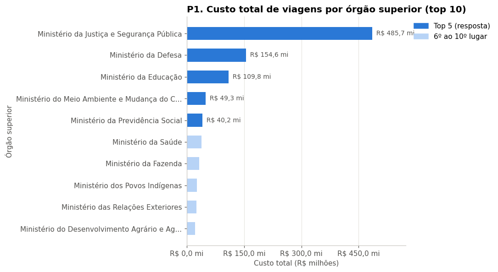
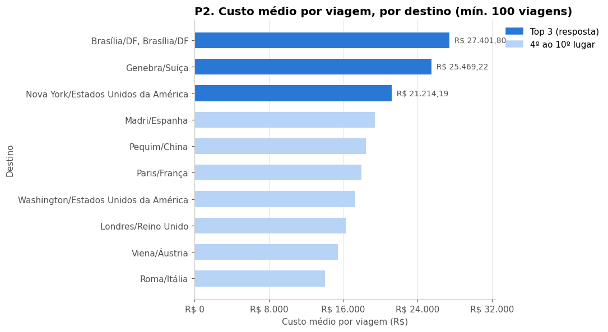
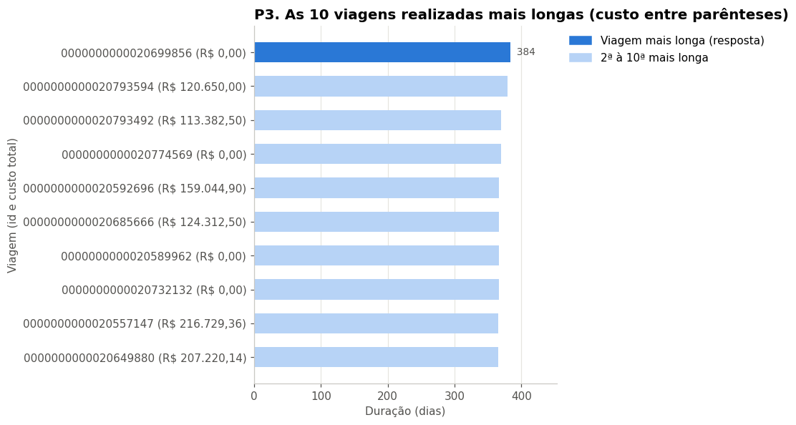
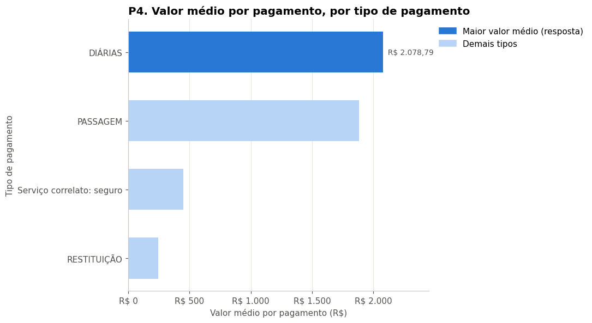
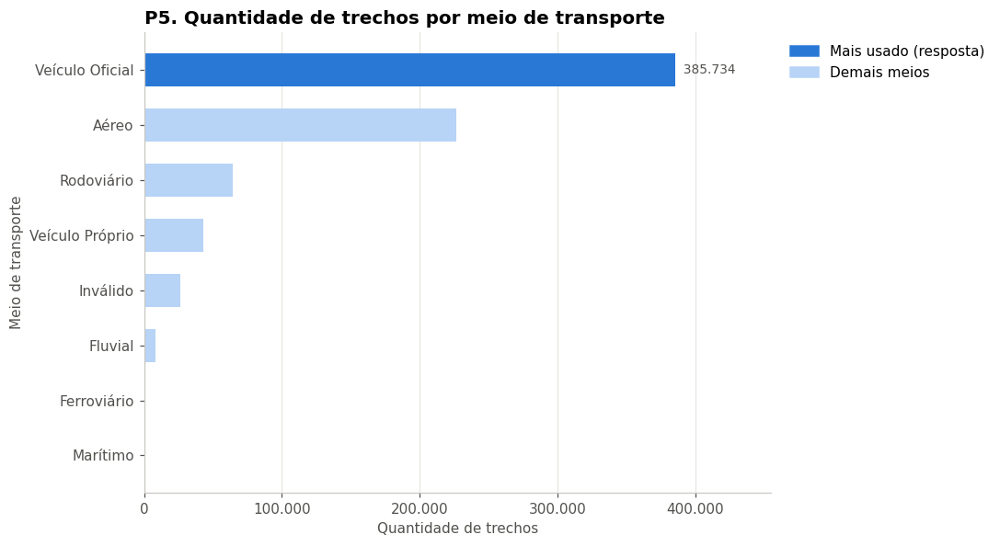
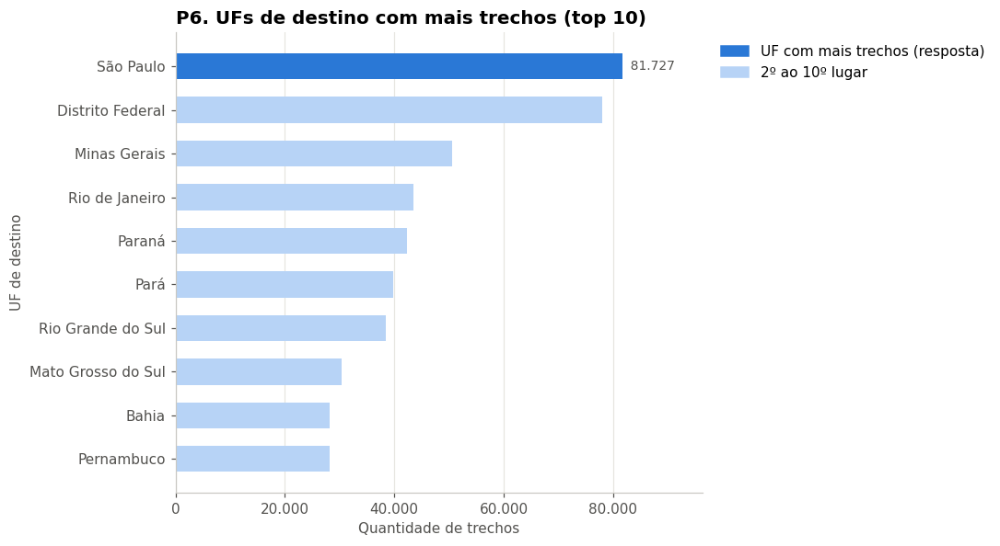
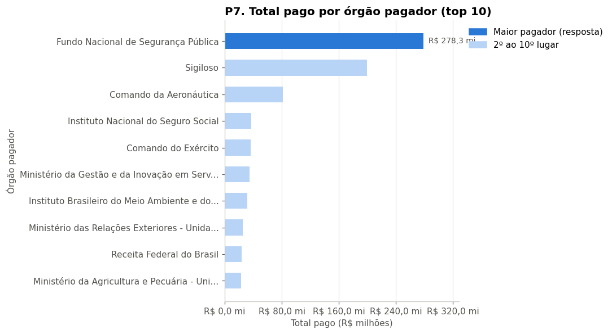

# Pipeline ETL: Viagens a Serviço do Governo Federal

Pipeline de dados de ponta a ponta em **Python + PostgreSQL**. Ele baixa os dados brutos de Viagens a Serviço do **Portal da Transparência** (jan–jun/2025, cerca de 1,9 milhão de linhas), preserva o original, limpa, modela e transforma tudo em **respostas de negócio com gráficos**, seguindo a **Arquitetura Medallion** (Raw → Silver → Gold).

> Projeto Avaliativo, Módulo 1: *Manipulação de Dados com Python e SQL* (SENAI/SC · SCTEC · Trilha Análise de Dados).

---

## 🎯 O problema

Uma consultoria de dados foi contratada pelo governo para dar mais transparência aos gastos públicos com viagens a serviço. Os dados já são públicos, mas chegam **brutos e desorganizados**:

- separador `;` e codificação `latin-1`;
- valores com vírgula decimal (`1272,97`) e datas em texto (`17/09/2024`);
- campos vazios e um espaço escondido no nome de uma coluna;
- 4 arquivos que precisam ser relacionados pela viagem.

A missão é um pipeline que **baixa, preserva, limpa e analisa**, respondendo a 7 perguntas de negócio.

## 🏗️ Arquitetura

```
 Portal da Transparência (.zip no Google Drive)
                 │  1_extrair.py (download + leitura em blocos)
                 ▼
 ┌──────────────────────────────────────────────┐
 │ RAW    cópia fiel do CSV · tudo VARCHAR      │  raw_viagem, raw_pagamento,
 │        sem chaves · idempotente (TRUNCATE)   │  raw_passagem, raw_trecho
 └──────────────────────────────────────────────┘
                 │  2_transformar.py (limpeza + tipagem + colunas calculadas)
                 ▼
 ┌──────────────────────────────────────────────┐
 │ SILVER DECIMAL e DATE · PK, FK e constraints │  silver_viagem (mãe)
 │        conferência Raw × Silver              │   ├─1:N─ silver_pagamento
 └──────────────────────────────────────────────┘   ├─1:N─ silver_passagem
                 │  3_analise.ipynb                  └─1:N─ silver_trecho
                 ▼
 ┌──────────────────────────────────────────────┐
 │ GOLD   JOIN + GROUP BY · tabela e VIEW       │  gold_pagamento_resumo / vw_…
 │        7 perguntas · gráficos · conclusões   │  gold_trecho_resumo / vw_…
 └──────────────────────────────────────────────┘
```

### Modelo da camada Silver

| Tabela | Chave | Relação | Constraints (2 por tabela) |
|---|---|---|---|
| `silver_viagem` | PK `id_viagem` | mãe | `NOT NULL` em `nome_orgao_superior` · `CHECK (valor_diarias >= 0)` |
| `silver_pagamento` | PK `id_pagamento` (SERIAL) | FK → viagem (1:N) | `CHECK (valor >= 0)` · `NOT NULL` em `tipo_pagamento` |
| `silver_passagem` | PK `id_passagem` (SERIAL) | FK → viagem (1:N) | `CHECK (valor_passagem >= 0)` · `CHECK (taxa_servico >= 0)` |
| `silver_trecho` | PK `id_trecho` (SERIAL) | FK → viagem (1:N) | `CHECK (numero_diarias >= 0)` · `UNIQUE (id_viagem, sequencia_trecho)` |

## 🧰 Técnicas e tecnologias

| Tecnologia | Uso |
|---|---|
| **Python 3** | orquestração do pipeline |
| **pandas** | leitura dos CSVs em blocos (`chunksize`), limpeza e conversão de tipos |
| **PostgreSQL** + **psycopg2** | armazenamento das camadas, carga em lote com `execute_values` |
| **requests** + **zipfile** | download automático do `.zip` e extração dos CSVs |
| **SQL** | DDL com PK/FK/CHECK/UNIQUE/NOT NULL, `JOIN`, `GROUP BY`, `HAVING`, `CREATE TABLE AS`, `CREATE VIEW` |
| **matplotlib** | gráficos com título, eixos nomeados e legenda |
| **Jupyter Notebook** | análise da camada Gold |
| **Git/GitHub** | versionamento com uma branch por funcionalidade |

Boas práticas aplicadas:

- **Idempotência:** `TRUNCATE` antes de cada carga. Rodar de novo nunca duplica.
- **Resiliência:** `try/except` + `rollback()`. Se algo falha, nada fica pela metade.
- **Integridade:** a tabela mãe é carregada antes das filhas, e as FKs são verificadas pelo banco.
- **Rastreabilidade:** a Raw é cópia fiel do CSV e a conferência Raw × Silver prova que nada se perdeu.
- **Segurança:** credenciais só no `.env`, que está fora do Git.
- **Código:** PEP-8, modular, com uma função por responsabilidade.

## 📁 Estrutura do repositório

```
desafio_transparencia/
├── config.py            # parâmetros + leitura do .env (fornecido)
├── banco.py             # conexão e utilitários do PostgreSQL (fornecido)
├── .env.example         # modelo das credenciais (copie para .env)
├── .gitignore           # ignora .env, data/, *.zip, *.csv
├── requirements.txt     # dependências
├── 0_criar_banco.sql    # FASE 0: banco + 8 tabelas (4 Raw + 4 Silver)
├── 1_extrair.py         # FASE 1: download + carga da Raw
├── 2_transformar.py     # FASE 2: Raw → Silver + conferência
├── 3_analise.ipynb      # FASE 3: Gold, 7 perguntas e gráficos
├── imagens/             # gráficos gerados pelo notebook
└── README.md
```

> A pasta `data/` (zip e CSVs) **não** vai para o GitHub: é grande e é recriada automaticamente pelo `1_extrair.py`.

## ▶️ Como executar

**Pré-requisitos:** Python 3.10+ e PostgreSQL 14+ instalados.

```bash
# 1. clonar e entrar na pasta
git clone https://github.com/cleitonassis-web/pipeline-etl-viagens.git
cd pipeline-etl-viagens

# 2. (opcional) ambiente virtual
python -m venv .venv
# Windows: .venv\Scripts\activate   |   Linux/Mac: source .venv/bin/activate

# 3. dependências
pip install -r requirements.txt

# 4. credenciais: copie o modelo e preencha a senha do seu PostgreSQL
#    Windows: copy .env.example .env   |   Linux/Mac: cp .env.example .env

# 5. FASE 0: banco e tabelas
psql -U postgres -f 0_criar_banco.sql
#    (no pgAdmin: rode a PARTE 1 conectado em "postgres", troque a conexão
#     para "transparencia" e rode a PARTE 2)

# 6. FASE 1: extração (baixa ~65 MB na primeira vez)
python 1_extrair.py

# 7. FASE 2: transformação + conferência
python 2_transformar.py

# 8. FASE 3: análise
jupyter notebook 3_analise.ipynb   # Kernel > Restart & Run All
```

Os passos 6 a 8 podem ser executados de novo quantas vezes quiser: o resultado é sempre o mesmo.

### Erros comuns

| Mensagem | Causa | Solução |
|---|---|---|
| `Cole o ID do arquivo no DRIVE_FILE_ID` | sem CSVs em `data/` e sem ID | confira o `DRIVE_FILE_ID` no `config.py` ou coloque os CSVs em `data/` |
| `fe_sendauth: no password supplied` | não existe `.env` | crie o `.env` a partir do `.env.example` |
| `can't decode byte 0xe7` | senha errada | confira `POSTGRES_PASSWORD` no `.env` |
| `can't decode byte 0xe3` | o banco ainda não existe | execute o `0_criar_banco.sql` |
| `relação "raw_viagem" não existe` | tabelas criadas no banco errado | rode a Parte 2 conectado em `transparencia` |
| `No module named 'psycopg2'` | bibliotecas fora do kernel | `pip install -r requirements.txt` no mesmo ambiente do Jupyter |

## 🧪 Decisões de tratamento

| Decisão | Regra adotada |
|---|---|
| Leitura dos CSVs | `sep=';'`, `encoding='latin-1'`, `dtype=str`, `keep_default_na=False`, blocos de 50 mil linhas |
| Carga da Raw | `INSERT` pela **posição** das colunas (o CSV de trechos tem espaço escondido no nome da 1ª coluna) |
| Valores | `texto_para_decimal`: vírgula → ponto + `pd.to_numeric(errors="coerce")` |
| Datas | `texto_para_data`: `pd.to_datetime(format="%d/%m/%Y", errors="coerce")` |
| Textos | `limpar_texto`: `strip()`; vazio vira `NULL` e o texto é limitado ao tamanho da coluna |
| Campos NOT NULL vazios | preenchidos com `NAO INFORMADO` (contados na conferência) |
| `valor_total` | diárias + passagens + outros gastos − devolução (vazios contam como 0) |
| `duracao_dias` | (data_fim − data_inicio) + 1 |
| Viagens analisadas | somente `situacao = 'Realizada'` |
| Pergunta 2 | somente destinos com **100 viagens ou mais** |
| Pergunta 4 | média ponderada: total pago ÷ nº de pagamentos |

### Conferência Raw × Silver

Ao final, o `2_transformar.py` imprime uma conferência automática:

| Conferência | Raw | Silver | Resultado |
|---|---:|---:|:---:|
| linhas de viagem | 341.860 | 341.860 | OK |
| linhas de pagamento | 606.916 | 606.916 | OK |
| linhas de passagem | 167.260 | 167.260 | OK |
| linhas de trecho | 763.349 | 763.349 | OK |
| datas de emissão vazias → NULL | 664 | 664 | OK |
| soma dos pagamentos (R$) | 1.194.365.457,37 | 1.194.365.457,37 | OK |

## 📊 Perguntas de negócio e conclusões

*338.476 viagens realizadas (99,0% das 341.860), jan–jun/2025. Todos os valores são calculados pelo `3_analise.ipynb`.*

| Nº | Pergunta | Resposta |
|---|---|---|
| 1 | Os 5 órgãos com maior custo total | 1º Ministério da Justiça e Segurança Pública: R$ 485,7 mi (41,3% do total). Depois vêm Defesa, Educação, Meio Ambiente e Mudança do Clima, e Previdência Social. Juntos, os 5 somam R$ 839,6 mi (71,3% do custo de 35 órgãos) |
| 2 | Os 3 destinos com maior custo médio por viagem | "Brasília/DF, Brasília/DF": R$ 27.401,80 (283 viagens) · Genebra/Suíça: R$ 25.469,22 (242) · Nova York/EUA: R$ 21.214,19 (149). O 1º custa 7,9x a média geral (R$ 3.478,42) |
| 3 | A viagem de maior duração e seu custo total | Viagem 0000000000020699856 (Ministério da Previdência Social): 384 dias (13/01/2025 a 31/01/2026), com custo registrado de R$ 0,00 |
| 4 | Tipo de pagamento com maior valor médio | Diárias: R$ 2.078,79 por pagamento (400.364 pagamentos), 1,1x o valor médio de Passagem (R$ 1.882,32) |
| 5 | Meio de transporte mais usado nos trechos | Veículo Oficial: 385.734 trechos (51,0% de 755.885). O 2º é Aéreo (30,0%) |
| 6 | UF de destino que aparece em mais trechos | São Paulo: 81.727 trechos (10,8%). SP, DF e MG concentram 27,8% dos trechos |
| 7 | Órgão que mais pagou no total | Fundo Nacional de Segurança Pública: R$ 278,3 mi (23,6% do total pago, em 79.715 pagamentos) |

### Gráficos

| | |
|---|---|
|  |  |
|  |  |
|  |  |
|  | |

### Insights

- **Concentração do gasto:** 5 de 35 órgãos respondem por 71,3% do custo, e só a Justiça e Segurança Pública responde por 41,3%.
- **Quem gasta ≠ quem paga:** o órgão que mais gasta (P1) não é o que mais paga (P7). O desembolso sai de fundos e unidades pagadoras específicas, como o Fundo Nacional de Segurança Pública.
- **Viagens internacionais** (Genebra, Nova York) estão entre os maiores custos médios, junto com deslocamentos múltiplos dentro de Brasília.
- **Transporte terrestre domina:** 51,0% dos trechos são feitos em veículo oficial, contra 30,0% em avião.
- **Diárias** são o tipo de pagamento de maior valor médio.

### Qualidade dos dados (leitura crítica)

- 18.545 viagens realizadas (5,5%) têm **custo R$ 0,00**, inclusive a mais longa. Isso indica gastos não registrados ou custeados por outra fonte.
- 13.630 viagens realizadas **terminam depois de junho**, porque o arquivo traz as viagens *iniciadas* no semestre.
- 3 viagens têm **custo negativo**: a devolução superou os gastos.
- 93.141 pagamentos vêm do órgão "Sigiloso", e 26.659 trechos têm meio de transporte "Inválido". Esses registros limitam parte da análise.

## 🚀 Melhorias futuras

- Orquestrar o pipeline (Airflow/Prefect) e agendar a atualização mensal.
- Usar `COPY` do PostgreSQL para acelerar a carga da Raw.
- Carga incremental por período, em vez de recarga total.
- Testes automatizados (pytest) para as funções de conversão.
- Dashboard interativo (Power BI / Streamlit) sobre as views Gold.
- Tratar os registros "Sigiloso" e "Inválido" em categorias próprias e investigar as viagens de custo zero.

## 👤 Autor

**Cleiton Luis Assis** · [GitHub](https://github.com/cleitonassis-web)
